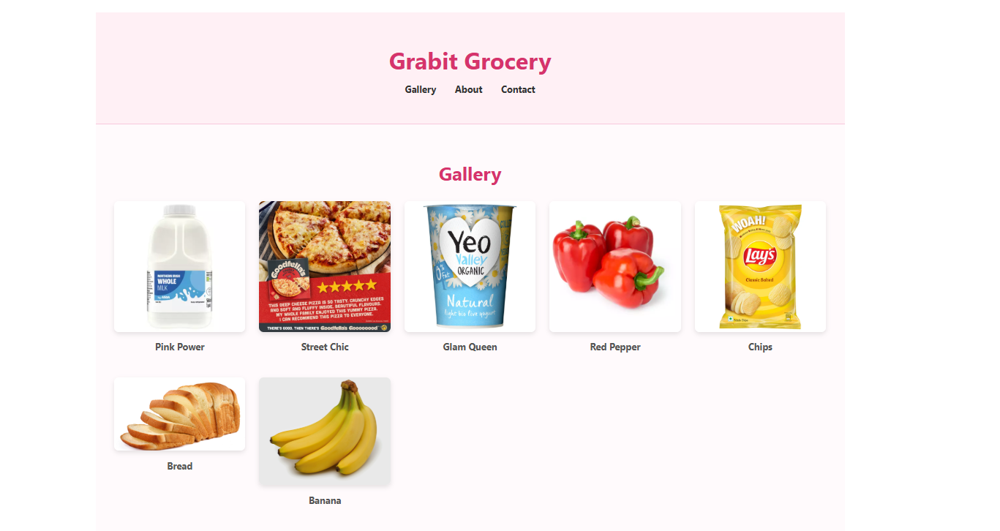

# Grabit Grocery 

Grabit Grocery is a sleek, responsive web app built to showcase Georgy's fresh produce and vibrant brand. Developed with React 19, Vite, and TypeScript, it delivers fast performance, clean design, and a delightful user experience across devices.

## 🌐 Live Site

👉 [Visit Grabit Grocery](https://grabitgrocery-site.vercel.app)  
👉 [Netlify Mirror](https://grabit-grocery-site.netlify.app)

## Screenshots

### Homepage



### Gallery


## Tech Stack

- **React 19** – Modern component architecture  
- **Vite** – Lightning-fast bundler and dev server  
- **TypeScript** – Type-safe development  
- **CSS Modules** – Scoped styling for components  
- **Netlify & Vercel** – Dual deployment for reliability

## Features

- Responsive layout for mobile and desktop  
- Modular components: Header, Gallery, About, ContactForm  
- Smooth hover effects and subtle animations  
- Clean routing and fast load times  
- Styled with a custom color palette and Google Fonts

## Getting Started

Clone the repo and run locally:

```bash
git clone https://github.com/Cloud-Architect-Emma/grabitgrocery-site.git
cd grabitgrocery-site
npm install
npm run dev
Folder Structure
Code
src/
├── App.tsx
├── main.tsx
├── Header.tsx
├── Gallery.tsx
├── About.tsx
├── ContactForm.tsx
├── assets/
└── index.css
Design Highlights
Color Palette: Soft pinks and vibrant accents for a fresh, friendly feel

Typography: Clean and modern with the Inter font

Layout: Centered content with flexible grid-based gallery

Accessibility: Semantic HTML and responsive design

Credits
Built by Emmanuela for Grabit brand vision. Designed to be fast, fresh, and future-ready.
